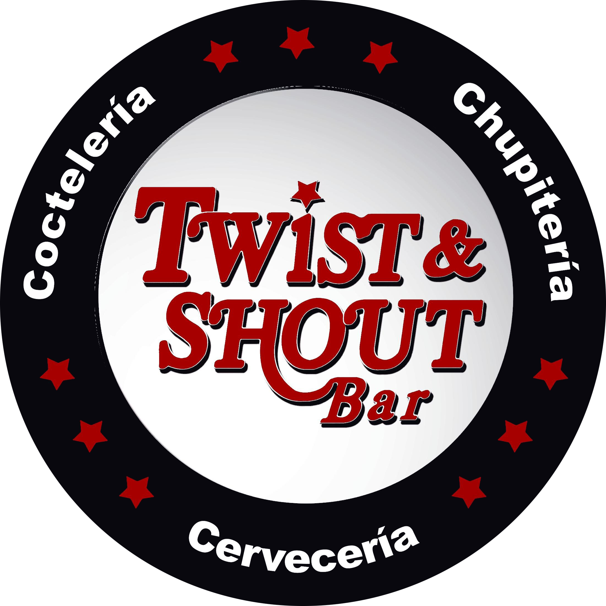
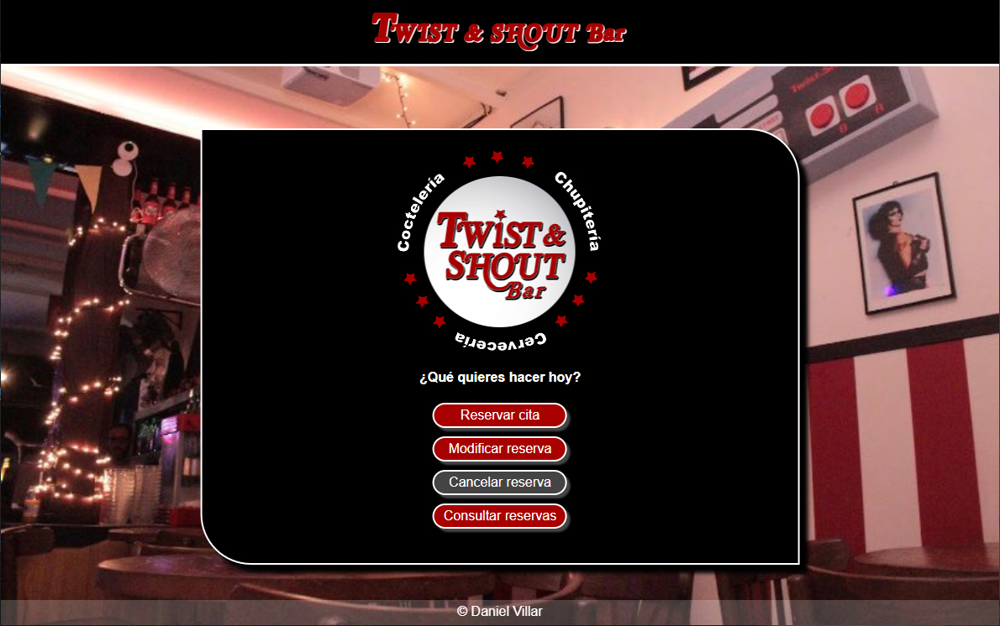
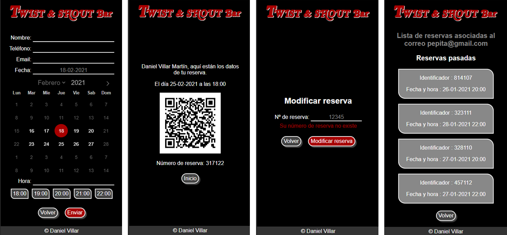

# App de citas

## Descripción

Aplicación para reservar mesa en un bar. El usuario puede crear una reserva, modificarla, cancelarla o consultar todas las que ha realizado.

La aplicación sigue los principios del diseño responsive, está en formato ordenador y móvil. El formulario de reserva incorpora el calendario Flatpickr y las horas disponibles se muestran por una petición AJAX. La reserva y consulta se realiza a través de un correo de confirmación y queda almacenada en un código QR. Los formularios de reserva y modificación de cita realizan validaciones tanto en el front como en el back. Los datos se almacenan en ficheros JSON.

## Caracerísticas

* HTML5, CSS3, JS
* SASS
* Diseño Responsive
* [Node.js](https://nodejs.org/es/)
* [Express.js](https://expressjs.com/es/)
* [Express-handlebars](https://www.npmjs.com/package/express-handlebars)
* [Flatpickr](https://flatpickr.js.org/)
* [Nodemailer](https://nodemailer.com/about/)
* [QRcode](https://www.npmjs.com/package/qrcode)

## Colaboraciones

